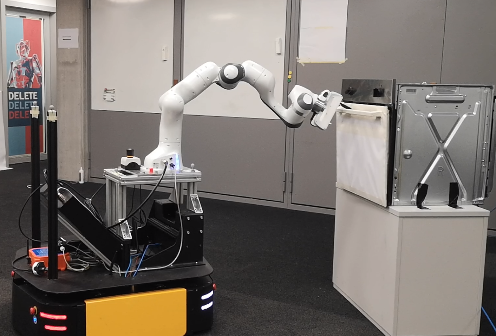
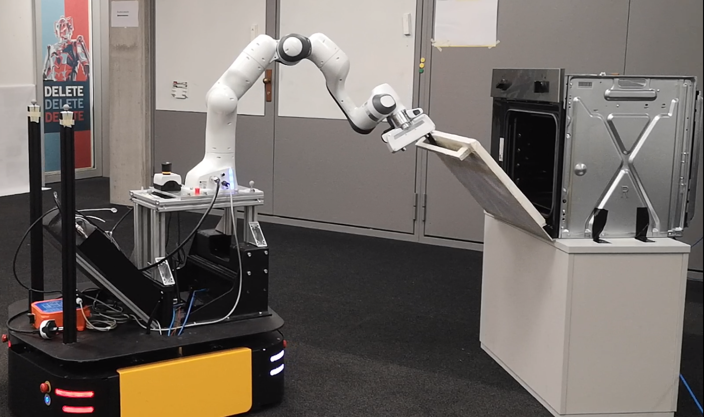
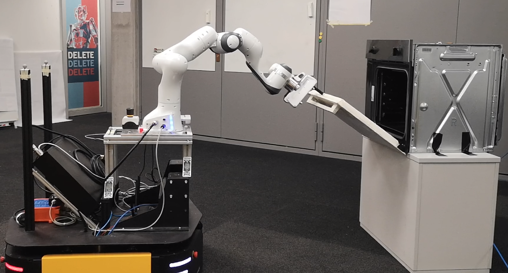
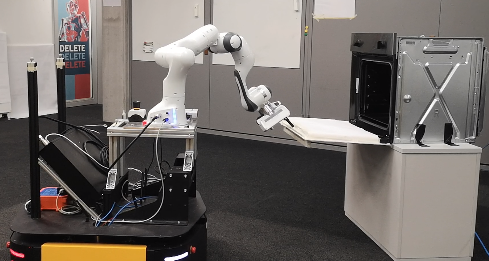

### Short description
The dataset consists of end-effector trajectories executed by a mobile manipulator with the task or opening or closing an oven. 
### Episodes
At the beginning of each episode, a partial point cloud is collected of the target object from the point of view of the agent. The agent then plans and executes a trajectory. The open/close task executed in a non-prehensile manner, therefore the robot gripper remains open throughout the entire interaction. No further images/pointclouds are collected during the episode.
### Preprocessing
The point cloud is not processed. 
### Resources and example images
More information is available on the project website [https://paulawulkop.github.io/agent_aware_affordances/](https://paulawulkop.github.io/agent_aware_affordances/)

  
   

  
  

